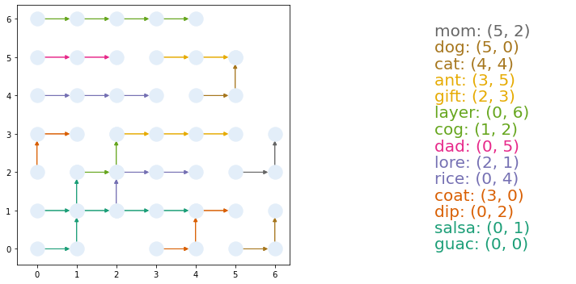

# Crosswords

Generating crosswords with interesting topology from clues using python networkx

## The idea

Traditional crosswords are designed partially by hand, so it is hard to quickly generate custom crosswords on topics you are interested in, e.g. a foreign language
or geography. 

This is an attempt to solve this problem by generating a new type of crossword. Designing a crossword based on fixed answers is a difficult problem, and probably
for most lists of words the only crosswords you can create will be very sparse. This is due to the rigidity of the format. We instead allow a much more flexible
layout. The crossword will consist of a directed graph with numbered nodes in which some of the paths have been colored. Each answer will be written along one 
colored path. The corresponding clue will tell you which colored path to look at it by indicating the start and the color of the path. The paths should be colored
in such a way that there is no ambiguity. 

## Usage

For now, just open the jupyter notebook demo.ipynb and run it. If the crosswords start to look good enough to use, I'll add the functionality to read .csv files of clue-answer pairs. More ambitiously, one can load in a large corpus of clue-answer pairs and draw subsets of those based on topic using some topic modeling.

## A first attempt

The first attempt is with a directed grid graph. The following crossword is for a 7x7 grid; for now the clues are just the answers.

The crossword is generated by putting the words in random order and greedily putting each word in so as to cross other words as many times as possible. There's an efficient algorithm for each greedy insertion based on Djikstra's algorithm. This is efficient/simple only because we have started with a graph with no directed cycles.

As you can see, things end up a bit sparse. There are a few fixes forthcoming. One is to try a graph with higher degree, for instance diagonals could be allowed
in the grid. Another is to encourage less "packing" of early solutions so that certain regions don't become blocked off by inaccessible letters. This could be done by randomly droppng nodes earlier on. Finally, one could
sort the words so that similar words are inserted at similar times.

Also, I have yet to implement a non-ambiguous coloring scheme. One sees that the paths for "salsa" and "guac" cross and are both green. In principle, a non-ambiguous coloring scheme isnt' **needed**, but it might be desirable so that solvers don't have to backtrack.

## Sorting

TODO

